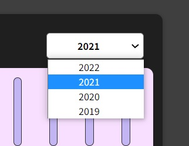

# Expense Tracker

This is a web app which helps you to keep track of your daily/monthly expenses.

## React/JS Topics covered

Following React/JS topics are covered in this web app - 

- Reusable functional components
- useState Hook
- Functions as props
- Reusable UI components
- Inline css/ style prop
- Spread operator
- Array/ object destructuring
- Event handling
- Array filter()/ map()
- Conditional rendering
- Forms
- Two way binding
- Children prop

## Features
Following features are available in this web app - 

### 1. Main page/ show-expense page
This page shows yearly expenses in a chart format (month wise).

### 2. Add-expense
Here, you can add a new expense.

### 3. Filter-by-year
You can filter the expenses by year.
